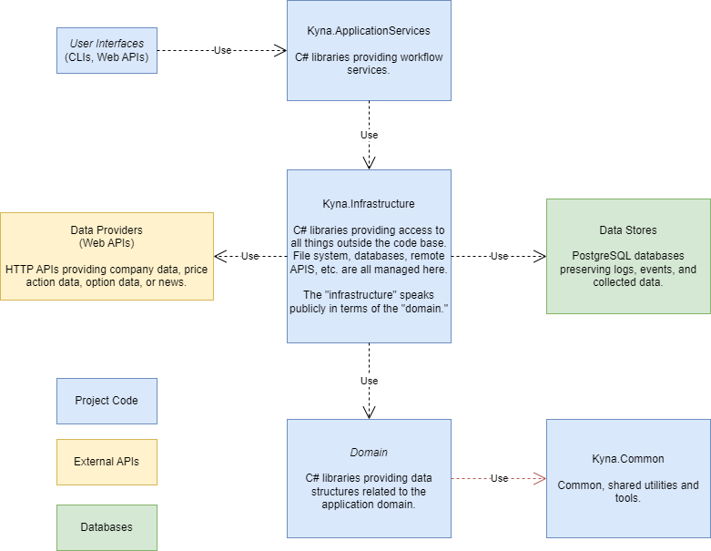
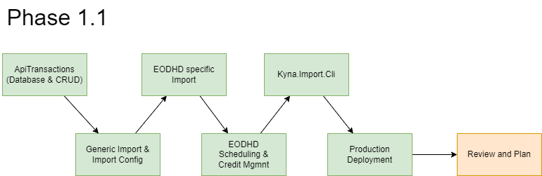

# Kyna

[Kyna](https://www.theparentz.com/baby-names/kyna) is an MIT-licensed, open-source project with the goal of creating a stable framework from which coders/traders/investors can collect historical stock data, backtest trading ideas against that data, and make informed decisions with their money.

What we're doing here is not groundbreaking science, but it is 100% transparent and grounded in a set of tools available to retail investors. Anyone is welcome to a copy of the code repository for their own purposes. Those who want to *contribute* are invited to do so - we welcome the help from any interested and capable party.

If the development process or the thought processes behind the decisions are of interest to you, such things are being actively chronicled on the [Vic Sharp YouTube Channel - Kyna Project Playlist](https://www.youtube.com/playlist?list=PLGw44r0iH8bayhAUZsMaK15Ny7--x8Mq_). *Don't forget to like and subscribe.*

## Designs

Kyna is intended to be a suite of software tools that

1. collect historical pricing and volume data for equity and option markets,
2. collect financial news,
3. analyze the efficacy of tradeable events,
4. report on results of backtesting analysis,
5. and identify possible points of timely interest within the market.

### Context

### Architecture

---

## Current Phase (1.1)

The objectives of this phase are:

1. Define the model for preserving data from third-party APIs.
2. Construct a generic import mechanism for capturing and preserving data.
3. Build an import tool for interfacing with the [eodhd.com API](https://eodhd.com/) and compose an algorithm for API credit management.
    1. Equity data (required).
    2. Fundamental data (desired).
    3. Options data (desired).
4. Build and test a CLI for managing data imports.
5. Deploy the import CLI to a "production" environment.

## Upcoming Objectives

1. Create a news collector.
    1. Map the news to our symbol (ticker) data.
    2. Explore the possibility of determining sentiment. 
2. Construct a backtesting system and use it to create accurate and reliable tables of technical analysis statistics for a variety of indicators (e.g. moving averages, candlestick patterns, etc., etc.).
   
---

## Project History
  
### Phase Zero
#### Completed 25-Jan-2024

Phase Zero (0) was centered around the core plumbing of the application - shelling out the .NET architecture and prototyping the command line interfaces that will be used to accomplish the objectives listed above.

Phase Zero was chronicled in the following YouTube videos:

1. [Intro to the Project](https://www.youtube.com/watch?v=WYS0sxiRKO0)
2. [Creating the DB Context](https://www.youtube.com/watch?v=SWtjWNUZ8dw)
3. [Creating a Custom PostgreSQL Logger Provider](https://www.youtube.com/watch?v=oPaNXDXvYC0)
4. [Phase Zero Review](https://www.youtube.com/watch?v=g39s5nZ0cuA)

---

### Backtesting Approach

The backtesting approach will be as scientific as possible. Take an established hypothesis (there are many to choose from), construct a test, run the test, and measure the results. Refine and repeat. Abandon the ideal or integrate the information into your trading strategy. 

The backtesting engine must never be allowed to look forward. Given any pattern or criterion, the backtesting engine must make all decisions based only on information available at the time of the event analyzed. Even data such as the average height of a candle or average move per day must always be constrained to the information preceding the event being analyzed.

Many "indicators" or "patterns" evangelized in the finfluencer marketplace require that the market and/or price action be in a certain state (e.g., "trend") for the indicator to be valid. An example of this is the "Bullish Engulfing" candlestick pattern; for this pattern to be "valid," it must occur in a "downtrend." Determining "trend" will be an early priority within the project.

Determining success of an indicator (e.g., does the stock go up or down after {INSERT PATTERN HERE}?) is, of course, a top priority. To properly gauge the efficacy of a given indicator, a baseline probability of "success" is required. Early in the process, we will randomnly select price points on many charts and check the up/down ratio to use as our measuring stick. In other words, by throwing a dart at the chart, is it more likely to go up or down 10% from that point? 

Some potential baseline up/down ratios we intend to consider:

| Up  | Down | Notes             |
| --- | ---- | ----------------- |
|  5% |  5%  |                   |
| 10% | 10%  |                   |
| 20% | 20%  |                   |
| 24% |  8%  | Classic 3:1 ratio |
