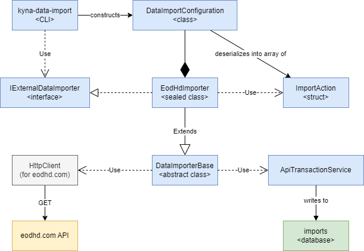
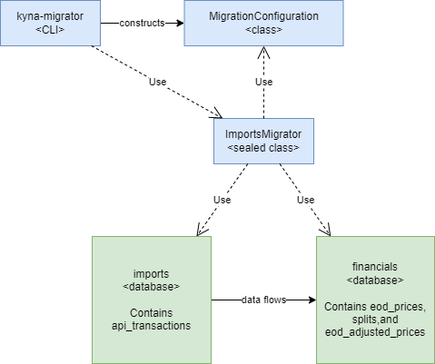
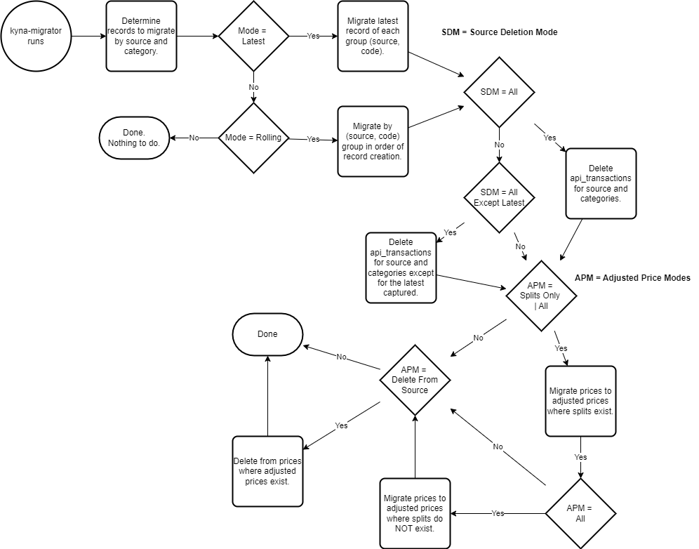

# Kyna Designs

## Data Import

The following diagram represents an approximation of the `kyna-data-import` application's design and dependencies.



The CLI, `kyna-data-import`, instantiates an implementation of `IExternalDataImporter` based on the `-s <source name>` argument. Currently, the only supported implementation is the `EodHdImporter`, which has a source name of `eodhd.com`. The `<source name>` must correspond to the `Source` property in your `IExternalDataImporter` implementation (see below) for the connection to take place.

Each implementation of `IExternalDataImporter` must contain some sort of configuration data structure, represented in the diagram as `DataImportConfiguration`. I had hoped to have a generic import configuration, but it ultimately didn't make sense - the variations between the possible importers is too great to try to generify, so each importer will require it's own configuration structure, which may be housed inside the importer class.

`ImportAction` is a simple struct. The `EodHdImporter` takes in its known configuration structure (e.g., `DataImportConfiguration`) and deserializes it into whatever it needs, which must include some representation of one or more `ImportAction` instances.

The `ImportAction` instances inform the `ImportAsync` function what to do to complete the import task.

Each `IExternalDataImporter` implementation should inherit from `DataImporterBase`, which contains references to `ApiTransactionService` (which writes to the `imports.api_transactions` table) and an `HttpClient` instance, which is responsible for communicating with the third-party API.

```csharp
public interface IExternalDataImporter
{
    string Source { get; }

    Task<TimeSpan> ImportAsync(CancellationToken cancellationToken = default);

    event EventHandler<CommunicationEventArgs>? Communicate;

    Task<string> GetInfoAsync();

    void Dispose();
}
```

Not shown in the diagram above is the `secrets.json` file, which contains the database connection strings and also the secret key for the third-party API.

An example of the `secret.json`:

```json
{
  "ConnectionStrings": {
    "Logs": "User ID=postgres;Password=secret_password;Host=127.0.0.1;Port=5432;Database=logs;",
    "Imports": "User ID=postgres;Password=secret_password;Host=127.0.0.1;Port=5432;Database=imports;"
  },
  "DatabaseEngines": {
    "Logs": "PostgreSql",
    "Imports": "PostgreSql"
  },
  "ApiKeys": {
    "eodhd.com": "MY-SECRET-KEY"
  }
}
```

The name of the key, `eodhd.com` in the `ApiKeys` section above must correspond to the `Source` property of your `IExternalDataImport` implementation and, of course, the value must be a valid key.

The `DataImportConfiguration` class is a deserialized implementation of a JSON file passed into the `kyna-data-import` application using the `-f <file name>` argument. For samples of possible configuration files, see the `configs` folder under the `Kyna.FinancialDataImport.Cli` project in the Kyna solution.

The configuration file is passed on the command line, deserialized into the appropriate class, and then used in the instantiation of your `IExternalDataImporter` implementation. See the `ConfigureImporter` function in the `Program.cs` in the `Kyna.FinancialDataImport.Cli` project.

### Creating a new `IExternalDataImporter` Implementation

1. Create a new class that inherits from `DataImportBase` and implements `IExternalDataImporter`.
1. Create a class that represents the input configuration and will cover your input needs. Consider housing this class within your importer.
1. Build a constructor that takes in the configuration class from the step above and in that constructor, convert your nested class into a collection of `ImportAction` instances (and other stuff as needed).
1. Write the `ImportAsync` function to perform your import tasks based on those `ImportAction` instances (and any other configuration that you want to include.)
1. Ensure that the `Source` property in your importer implementation corresponds to the name of your external API, is unique within your system, and aligns with one and only one key in the `ApiKeys` section of your `secrets.json` file.

#### Notes

The abstract class, `DataImportBase` contains a few `protected virtual` functions that you can use or override.

The first is `HideToken`, which is used to obfuscate your secret key when writing to the `imports.api_transactions` table. This prevents your secret key from leaking.

The second is `GetStringResponseAsync`, which makes use of the `HttpClient` to make calls to the external API, write them to the `imports.api_transactions` table, and return the response as a string.

The final is `InvokeApiCallAsync`, which calls `GetStringResponseAsync`, but throws away the string result.

The reason for both `GetStringResponseAsync` and `InvokeApiCallAsync` is that sometimes you need the results in real-time, like when the results inform some subsequent import action you want to take. For example, in the `EodHdImporter` class, a list of symbols is captured (and filtered) and that list of symbols is used for capturing price (and other) data. Other calls are simply made and passed to the `ApiTransactionService` to be written to the data store without the importer concerning itself with their content.

## Data Migration

Kyna data migration is the process of migrating data from the `imports.api_transactions` table to tables in the `financials` database.
The process is controlled by the `Kyna.DataMigration.Cli` project and operates similarly to the import process.
Activities are controlled by a JSON configuration file passed to the CLI executable.

The architecture for migration is simpler than import, as shown here:



The migration flow, however, is a bit more complicated, as shown here:



There are three `enum`s to consider and they are defined in the `MigrationConfiguration.cs` file.

The first is `MigrationMode`, which has two possible values:

| Mode    | Meaning                                                                                                                                |
| ------- | -------------------------------------------------------------------------------------------------------------------------------------- |
| Latest  | When chosen, only the latest `api_transactions` records for the specified source and category are migrated.                            |
| Rolling | When chosen, all records for the specified source and category are migrated - in ascending order of the `api_transactions.created_utc` |

The second enum is `SourceDeletionMode`. This enum relates to the deletion of `api_transactions` records in the `imports` database.

| Mode            | Meaning                                                                  |
| --------------- | ------------------------------------------------------------------------ |
| None            | No `api_transactions` records will be deleted.                           |
| All             | All records that were migrated will be deleted.                          |
| AllExceptLatest | All migrated records except the last (by `created_utc`) will be deleted. |

The final relevant enum is `AdjustedPriceModes` which has the `[Flags]` attribute, allowing for multiple selections with the `|` operator.
This enum controls both the creation and the deletion of records within the `financials.eod_prices` table.

| Flag             | Meaning                                                                               |
| ---------------- | ------------------------------------------------------------------------------------- |
| OnlySplits       | Only codes (tickers) with split data are migrated to the `eod_adjusted_prices` table. |
| All              | Price data with zero splits are also migrated to the `eod_adjusted_prices` table.     |
| DeleteFromSource | Records in `eod_prices` with corresponding `eod_adjusted_prices` records are deleted. |

These `enum`s are set via the `MigrationConfiguration` file, as demonstrated in these examples.

The following file will:

1. migrate the **latest** price and split data from `imports.api_transactions` to `financials.eod_prices` where the source is `eodhd.com`;
2. **not** delete any `api_transactions` records;
3. migrate all `eod_prices` records to `eod_adjusted_prices` (regardless of whether splits exist);
4.  **delete** all migrated records from `eod_prices`;
5.  and constrain **parallelization** to no more than 5 threads.

```json
{
  "Source": "eodhd.com",
  "Categories": [
    "EOD Prices",
    "Splits"
  ],
  "Mode": "Latest",
  "Source Deletion Mode": "None",
  "Adjusted Price Mode":  "All, Delete From Source",
  "MaxParallelization": 5
}
```

When building your configuration file, you can use either the `enum` string value or the value from the `Description` attribute.

For example, this enum:

```csharp
[Flags]
public enum AdjustedPriceModes
{
    None = 0,
    [Description("Only Splits")]
    OnlySplits = 1 << 0,
    All = 1 << 1,
    [Description("Delete From Source")]
    DeleteFromSource = 1 << 2
}
```
means that these two lines (in your JSON file) are equivalent:

```json
"Adjusted Price Mode":  "All, Delete From Source",
"Adjusted Price Mode":  "All, DeleteFromSource",
```
